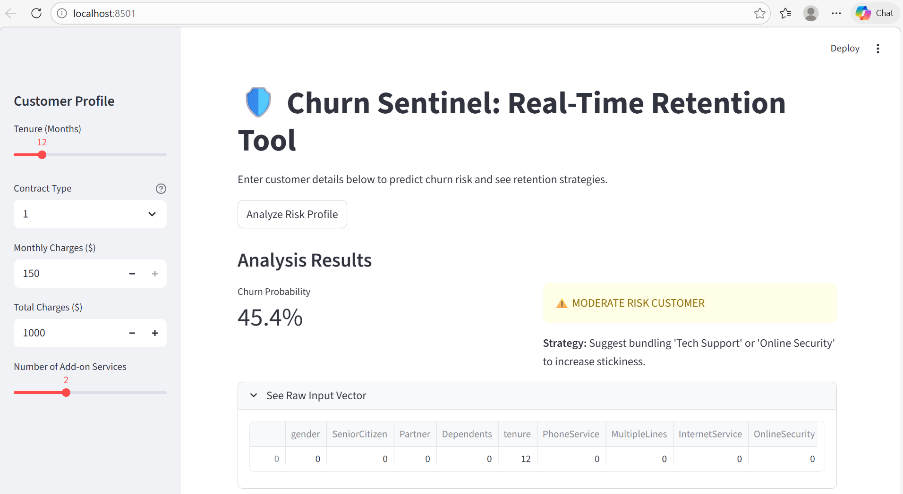

<p align="center">
  
</p>

## 🚀 Overview
**Churn Sentinel** is a production-ready Machine Learning pipeline designed to identify at-risk customers before they leave. By transforming raw telecom data into actionable insights, this tool helps businesses reduce revenue leakage and optimize retention strategies.

---

## 🛠️ The Pipeline Architecture
This project follows a professional modular structure, separating the data engine from the user interface.


* **Backend**: Handles data cleaning, feature engineering, and model training using **Random Forest**.
* **SMOTE Implementation**: Addresses class imbalance to ensure the model accurately detects churners (the minority class).
* **Frontend**: A high-performance **Streamlit** dashboard for real-time inference.

---

## 📊 Business Impact
* **Proactive Retention**: Moves the business from reactive "exit surveys" to proactive "prevention."
* **Domain Agnostic**: While built for Telecom, the architecture supports **SaaS, Banking, and E-commerce** subscription models.
* **Data-Driven Decisions**: Provides a specific **Churn Probability %** to help managers prioritize high-value at-risk clients.

---

## 💻 How to Run Locally

### 1. Clone the Repository
```bash
git clone [https://github.com/Anchal1811/Customer-Churn-Analysis.git](https://github.com/Anchal1811/Customer-Churn-Analysis.git)
cd Customer-Churn-Analysis
